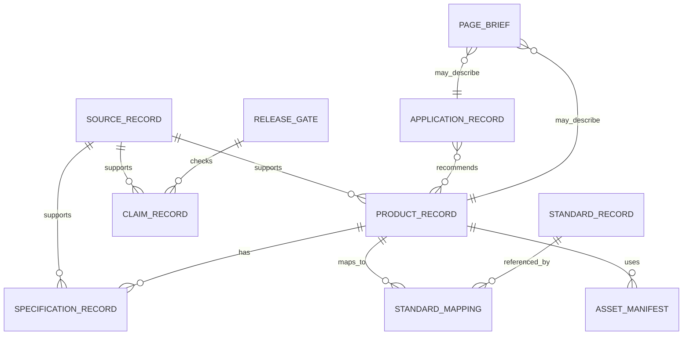

# Entity Relationship Model

## Core Entities

## Relationship Principles

- A standard does not prove a product complies by itself.
- A `standard_mapping` record is required to connect product, standard, clause/test item, configuration, evidence, and reviewer.
- Specifications are structured records, not WYSIWYG text.
- Claims are reviewed independently from marketing copy.
- Assets must carry rights, source, and public-use status.
